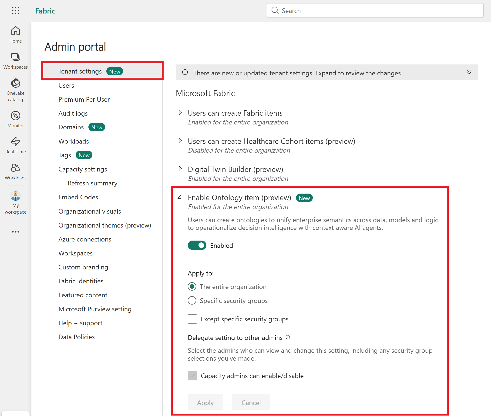
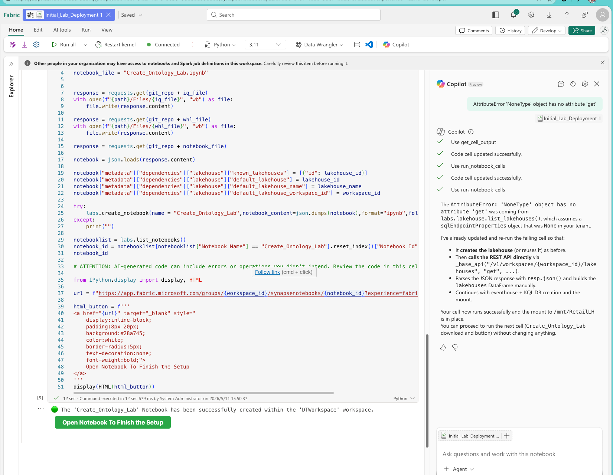
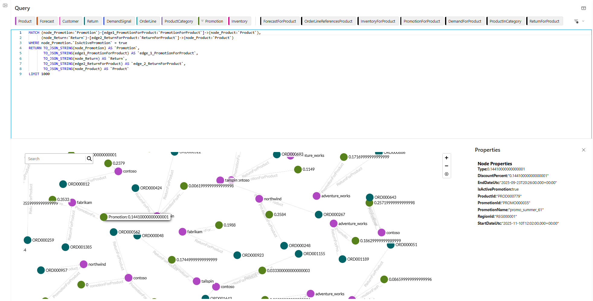
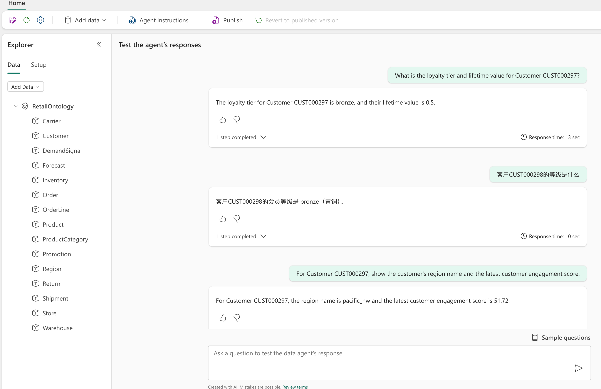

## 概述

在這個約 60 分鐘的動手實驗中，你會透過一個零售供應鏈場景，體驗 [Fabric IQ（預覽版）](https://learn.microsoft.com/fabric/iq/overview) 的核心功能。環境初始化 notebook 會自動建立實驗所需的項目，你只需要把重點放在本體概念、圖可視化、GQL 查詢以及 Data Agent 互動上。

## 場景概覽

假設你在一家虛構的零售公司工作，公司在多個區域管理訂單、產品、客戶、倉庫和配送，同時還會追蹤庫存、需求訊號、預測和促銷活動。本實驗會帶你看看 Fabric IQ 如何用本體把這些資料統一起來，以圖的形式呈現，並支援透過 GQL 和對話式 Data Agent 進行查詢。

### 為甚麼選擇零售供應鏈

零售供應鏈很適合用來示範本體功能，因為它能代表企業裏常見的幾類資料問題：

* **資料分散在多個系統裏。** 訂單可能進入 Eventhouse 做即時分析，而產品目錄和客戶資料可能放在 Lakehouse 裏做批次處理。在傳統做法下，分析師要先弄清楚哪些資料在哪個系統裏，再自行想辦法跨系統關聯。
* **關係才是洞察的關鍵。** 例如「西南區域有哪些促銷活動帶來了退貨？」這樣一個問題，就需要從退貨一路關聯到產品、促銷和區域。用一般資料表來做會比較迂迴，而圖可以直接表達這些關係。
* **業務語言和技術欄位不是一回事。** `cust_lt_val` 或 `prod_cat_id` 這樣的欄名不符合業務使用者平時的表達方式。本體可以把這些技術欄位映射成 *Customer lifetime value*、*Product category* 這樣的業務概念，讓大家用同一套語言溝通。
* **不同角色都需要使用這些資料。** 資料工程師關心架構和沿襲，分析師想用可視化方式探索關係，業務使用者則希望直接用自然語言提問。本體、圖和 Data Agent 可以基於同一套資料，滿足不同角色的使用方式。

本實驗會用一組接近真實業務的零售實體和關係，帶你從原始資料表一路看到語意模型，再看看對話式 AI 如何使用這些資料。

### 實體和關係

本實驗的本體包括以下實體類型：

| 實體類型 | 說明 |
| --- | --- |
| *Order* | 客戶購買交易 |
| *OrderLine* | 訂單中的單個明細項 |
| *Customer* | 與訂單關聯的下單客戶 |
| *Product* | 可供銷售的商品 |
| *ProductCategory* | 相關產品的分組 |
| *Store* | 產生訂單的零售門市 |
| *Region* | 包含門市和倉庫的地理區域 |
| *Warehouse* | 發出訂單的履約中心 |
| *Carrier* | 處理配送的物流服務商 |
| *Shipment* | 將訂單關聯到物流服務商的配送記錄 |
| *Inventory* | 倉庫中的庫存水平 |
| *Forecast* | 產品的預測需求 |
| *DemandSignal* | 客戶需求的即時指標 |
| *Promotion* | 影響產品銷售的營銷活動 |
| *Return* | 與訂單關聯的退貨項目 |

關鍵關係包括 *Order* &rarr; *Customer*、*Order* &rarr; *Region*、*OrderLine* &rarr; *Product*、*Product* &rarr; *ProductCategory*、*Shipment* &rarr; *Carrier* 和 *Shipment* &rarr; *Warehouse*。

## 實驗時間線

| 時間 | 活動 | 章節 |
| --- | --- | --- |
| 0 到 5 分鐘 | 執行設定 notebook | [步驟 1：部署環境](#步驟-1部署環境) |
| 5 到 20 分鐘 | 介紹 IQ 和本體概念 | [步驟 2：了解 IQ 和本體概念](#步驟-2了解-iq-和本體概念) |
| 20 到 35 分鐘 | 圖重新整理期間，先探索已部署項目 | [步驟 3：探索已部署項目](#步驟-3探索已部署項目) |
| 35 到 45 分鐘 | 探索圖 UI | [步驟 4：探索圖](#步驟-4探索圖) |
| 45 到 55 分鐘 | 執行 GQL 查詢 | [步驟 5：執行 GQL 查詢](#步驟-5執行-gql-查詢) |
| 55 到 58 分鐘 | Data Agent 示範 | [步驟 6：試用 Data Agent](#步驟-6試用-data-agent) |
| 58 到 60 分鐘 | 總結和路線圖 | [步驟 7：總結](#步驟-7總結) |

## 步驟 1：部署環境

一個 Fabric notebook 會一次過建立本實驗需要的項目，包括：

* 名為 **EHRetail** 的 Eventhouse，其中包含預先準備好的資料表
* 名為 **LHRetail** 的 Lakehouse，其中包含輔助資料
* 一個包含實體類型、關係類型和資料繫結的本體

開始之前，請先確認你的租用戶已啟用本體功能。如果你在 Fabric 裏看不到本體相關選項，請讓租用戶管理員開啟 Fabric IQ ontology 預覽設定。



### 上載並執行設定 notebook

<!-- TODO: Add notebook source location (GitHub repo URL, pre-loaded workspace, or download link) -->

1. 下載實驗講師提供的設定 notebook 檔案（*.ipynb*）。
1. 開啟你的 Fabric 工作區。
1. 選取 **+ New item** > **Import notebook**。
1. 選取 **Upload**，瀏覽並選取你下載的 notebook 檔案，然後選取 **Open**。
1. 等候上載完成。上載後，該 notebook 會顯示在工作區項目清單中。
1. 開啟上載的 notebook。
1. 選取 **Run all** 執行 notebook。

   notebook 會自動完成以下操作：

   * 建立 Eventhouse 和 Lakehouse 項目
   * 為所有資料表產生零售範例資料
   * 建立包含實體類型和關係類型的本體
   * 將實體類型繫結到資料來源
   * 觸發圖重新整理

   > [!IMPORTANT]
   > 圖重新整理會在背景執行，通常需要大約 10 到 15 分鐘。這個過程無法手動加速，重新整理期間你可以繼續完成後面的步驟。

1. 確認 notebook 的所有儲存格都已成功執行且沒有報錯。你應該能看到每個項目建立步驟的成功訊息。

   

## 步驟 2：了解 IQ 和本體概念

圖重新整理在背景執行時，可以先花一點時間了解 Fabric IQ 背後的核心概念。

這裏是預留內容。現場實驗時，講師會在這個時段講解 PowerPoint，請學員跟隨講師節奏。

## 步驟 3：探索已部署項目

等待圖重新整理完成時，可以先看看 notebook 建立了哪些項目。

### 檢視 Eventhouse 資料表

1. 在 Fabric 工作區中，選取 **EHRetail** Eventhouse。
1. 開啟資料庫並檢視以下資料表：

   | 資料表 | 說明 |
   | --- | --- |
   | *carriers* | 承運商 ID、服務類型代碼和覆蓋區域識別碼 |
   | *customers* | 客戶 ID、忠誠度等級代碼、生命週期價值分數和聯絡資料欄位 |
   | *demand_signals* | 產品和區域 ID 組合、訊號強度值以及時間戳記 |
   | *forecasts* | 產品 ID、預測需求數量和預測週期日期 |
   | *inventories* | 倉庫和產品 ID 組合、庫存數量以及補貨閾值 |
   | *products* | 產品 ID、折扣百分比和生效日期（事實/交易資料） |
   | *regions* | 區域代碼、時區偏移以及冷鏈標記等營運標誌 |
   | *shipments* | 配送 ID、訂單/承運商/倉庫外部索引鍵和狀態代碼 |
   | *stores* | 門市 ID、位置座標和營運屬性 |

1. 選取任意資料表並檢視原始資料。注意，這些是「原始」的營運資料：欄名不一定適合業務使用者閱讀，很多值也可能只是 ID，而不是有業務含義的名稱。這正是本體要解決的問題：在原始資料之上補上一層業務語意。

### 檢視 Lakehouse

1. 返回工作區並開啟 **LHRetail** Lakehouse。
1. 在 **Lakehouse explorer** 窗格中展開 **Tables** 資料夾。你應該能看到 notebook 根據零售範例資料建立的 Delta 資料表。這些資料表會作為本體的額外資料來源。
1. 選取一個資料表（例如 *orders* 或 *returns*）預覽其內容。將這裏的結構與 Eventhouse 資料表進行比較。注意：

   * Lakehouse 資料表可能包含不同的欄，也可能提供 Eventhouse 資料表中沒有的補充資料。
   * 本體中的某些實體類型會繫結到 Lakehouse 資料表，而不是 Eventhouse 資料表。這個設計可以展示本體如何統一多個儲存引擎中的資料。

1. 比較兩個引擎中的 *products* 資料：

   * 在 Lakehouse 中，*products* 資料表包含**維度資料**，也就是描述每個產品的靜態屬性，例如名稱、類別和價格。
   * 在 Eventhouse 中，*products* 資料表包含**事實資料**，也就是不同時間點套用到不同產品上的折扣記錄。
   * 這兩個資料表其實是在描述同一個業務概念（*Product*）的不同側面。本體會把它們統一到同一個 *Product* 實體類型下，因此 Graph 查詢和 Data Agent 等下游使用者不需要關心每個欄位來自哪個引擎。

1. 檢視 **Table details**，了解資料列數、架構和欄類型。這有助於你理解本體所處理的資料規模。

   > [!TIP]
   > Lakehouse 和 Eventhouse 在這個場景中各有分工。Eventhouse 存放適合即時查詢的營運和串流資料，Lakehouse 存放批次處理和歷史資料。本體會把它們統一到同一組業務概念之下。

### 探索本體結構

1. 返回工作區並開啟 **Ontology** 項目。
1. 在 **Entity Types** 窗格中檢視實體類型清單。你應該能看到[場景概覽](#場景概覽)中列出的全部 15 個實體類型。
1. 先選取 **Product** 實體類型。前面你已經看到，產品資料分佈在兩個位置：Lakehouse 儲存維度屬性（名稱、類別、價格），Eventhouse 儲存事實資料（折扣記錄）。現在看看本體如何把它們整合起來：

   

   1. 在 **Entity type configuration** 右側窗格中檢視屬性和繫結。
   1. 檢視 *Product* 實體類型的屬性清單。注意，部分屬性繫結到 Lakehouse *products* 資料表中的欄（例如產品名稱、類別和單位成本），其他屬性則繫結到 Eventhouse *products* 資料表中的欄（例如折扣百分比和日期）。
   1. 選取 *Product* 的 **Bindings** 索引標籤。此索引標籤會顯示繫結到該實體的每個來源資料表卡片。

   

   > [!NOTE]
   > 這就是本體的核心價值：一個 *Product* 實體類型就能呈現這個業務概念的統一視圖，即使背後的資料來自兩個不同的儲存引擎。本體的使用者（Graph、GQL 和 Data Agent）不需要知道每個屬性具體來自哪裏。

1. 現在探索連接到 *Product* 的關係。

   * **ProductInCategory** - 將 *Product* 連結到對應的 *ProductCategory*，這樣你就能回答「哪些產品屬於冷凍食品類別？」之類的問題。
   * **InventoryForProduct** - 將 *Inventory* 記錄連結到 *Product*，顯示該產品在各個倉庫中的庫存水平。
   * **PromotionForProduct** - 將 *Promotion* 活動連結到目標 *Product*，把營銷活動和具體商品關聯起來。

   這些關係會把原本分散的資料表連成一張圖。你從一個 *Product* 節點出發，就可以找到它的類別、各倉庫庫存，以及正在進行的促銷活動，不需要自己寫 JOIN，也不需要知道每張資料表存在哪個引擎裏。

1. 檢視其餘關係類型，了解更廣泛的圖結構：

   * *OrderPlacedByCustomer*（下單客戶）
   * *OrderFulfilledToRegion*（訂單履約區域）
   * *OrderHasLineItem*（訂單包含的內容）
   * *ShipmentFulfillsOrder*（哪個配送履約了訂單）
   * *ShipmentDepartedFromWarehouse*（庫存所在位置）

1. 返回 **Data Bindings** 檢視，繼續查看更多實體類型的繫結。例如，*Customer* 實體類型會繫結到 EHRetail 中的 *customers* 資料表，也會繫結到 Lakehouse 中的 *customers* 資料表。你可以透過圖示來判斷繫結類型。

> [!TIP]
> Fabric IQ agent 會根據資料繫結類型調整推理方式。在後面的 Data Agent 步驟之前，先理解這個差異會很有幫助。
>
> **靜態繫結**指向維度資料或變化不頻繁的資料，例如客戶名稱、產品類別或區域時區。當 agent 使用靜態繫結回答問題時，它會：
>
> * 把屬性值當作目前事實。
> * 不做時間維度上的推理，也就是說它不能解釋某個值是*何時*變化的，也不能解釋*為甚麼*變化。
> * 返回類似這樣的答案：*“Customer CUST000297 的 loyalty tier 是 Gold。”*
>
> **時間序列繫結**指向隨時間變化的資料，例如感應器讀數、交易記錄，或帶時間戳記的需求訊號。當 agent 使用時間序列繫結回答問題時，它可以：
>
> * 追蹤按時間順序排列的觀察結果之間的因果關係。
> * 解釋某個狀態或條件出現的原因。
> * 推理異常、違規和趨勢。
> * 返回類似這樣的答案：*“由於來自 southwest 區域的三次連續高訊號讀數，產品 PROD00042 的需求在 14:30 激增。”*
>
> 這種差異很重要，因為同一個問題在不同繫結類型下可能得到完全不同的答案。產品狀態的靜態繫結只會返回一個簡單事實（*“該產品有庫存”*），而庫存水平的時間序列繫結則可以讓 agent 解釋庫存為甚麼下降，以及下降發生在甚麼時候。
>
> 在本實驗中，大多數繫結都是靜態繫結（Lakehouse 中的維度資料表，以及 Eventhouse 中的事實快照）。當你在[步驟 6](#步驟-6試用-data-agent)中試用 Data Agent 時，請記住這個區別。agent 的回答會受到本體中可用繫結類型的影響。另外，目前 Data Agent 只使用 NL->GQL。

## 步驟 4：探索圖

圖重新整理完成後，你就可以透過可視化介面探索這些已經連接起來的資料。

### 檢查圖重新整理狀態

繼續之前，請先確認設定 notebook 觸發的圖重新整理已經完成。

1. 在左側 Fabric 導覽列中，選取 **Monitor** 圖示。
1. 在監察檢視中，找到與你的本體相關的圖重新整理活動。

   

1. 如果重新整理仍在進行，請等待完成後再繼續。圖重新整理最多可能需要 15 分鐘，具體時間取決於資料量和目前容量使用情況。
1. 狀態顯示為 **Completed** 後，返回本體開始探索圖。

### 導覽圖檢視

1. 從 **Product** 實體開啟 **Entity type overview**。

   

1. 瀏覽頁面中與此實體相關的各個預覽區域。
1. 在左上角卡片中，選取 **Relationship Graph** 上的 **Expand**。這會開啟一個以 *Product* 節點為中心的圖檢視。

   

1. 圖檢視會把實體執行個體顯示為節點，把關係顯示為連接節點的邊。你可以：

   * **平移和縮放**來瀏覽圖。
   * **選取節點**來檢視其屬性和連接的實體。
   * **沿着邊移動**來周遊關係。

1. 試着看看目前 **Product** 節點如何連接到區域。選取節點後，節點周圍會展開一組工具。選取 **+** 號新增一個相連節點。在這個例子中，唯一可選項是 **Order**，選取它即可。接着對 **Order** 節點重複同樣操作，這次新增相連的 **Region** 節點。類似地，你也可以按一下某個節點，然後選取 **X** 將其從圖檢視中移除。注意，新增或移除節點時，對應的邊也會一起新增或移除。

   

   > [!IMPORTANT]
   > 在圖探索過程中，請不要對本體做任何資料或架構變更。圖重新整理成本較高且耗時較長，任何變更都可能觸發新一輪重新整理。

### 使用 UI 查詢圖

現在使用可視化查詢產生器執行查詢。我們要查找的是：哪些仍在進行的促銷活動，關聯到了發生退貨的產品。

1. 從 Product 功能表列中選取 **Clear query**。
1. 在圖查詢 UI 中，從右側窗格選取 **Return** &rarr; **Product** &rarr; **Promotion** 節點來建構路徑。
1. 將連接它們的邊 *ReturnForProduct* 和 *PromotionForProduct* 新增到路徑中。這樣查詢引擎就會從退貨記錄出發，經過關聯產品，再周遊到該產品對應的促銷活動。
1. 在 **Promotion** 節點上新增篩選器：將 **IsActivePromotion** 設定為 **true**。這樣結果就只會保留目前仍在進行的促銷。

   

1. 選取 **Apply** 確認查詢設定。
1. 選取 **Run** 執行查詢。
1. 檢視結果。你應該能看到一組仍在進行的促銷活動，而且這些促銷對應的產品也發生過退貨。像這樣把退貨關聯回營銷活動，在一般資料表查詢裏通常比較麻煩；但當資料建模成圖以後，就會直觀很多。

   

1. 選取 **Query builder** &rarr; **Code editor** 檢視可視化產生器產生的 GQL 查詢。這裏會顯示與你設定的路徑和篩選器對應的 GQL 語法。進入下一步手寫 GQL 之前，可以先花一點時間看看查詢結構。

## 步驟 5：執行 GQL 查詢

在此步驟中，你將使用 GQL（Graph Query Language，圖查詢語言）直接查詢本體圖。寫查詢之前，先簡單了解一下 GQL 是甚麼，以及為甚麼適合這個場景。

### 甚麼是 GQL

GQL 是面向圖資料庫的 ISO 標準查詢語言（[ISO/IEC 39075](https://www.iso.org/standard/76120.html)）。負責 SQL 的同一個 ISO 工作組也在制定 GQL，所以如果你寫過 SQL，會看到一些熟悉的概念，例如運算式、述詞、類型和篩選。

關鍵差異在於關係的表達方式。GQL 不需要用 JOIN 陳述式把資料表關聯起來，而是使用**可視化圖模式**直接描述你想周遊的連接。這樣查詢更易讀，也更貼近我們理解關聯資料的方式。

### 為甚麼使用 GQL 查詢本體

傳統 SQL 很擅長在單個資料表中查找資料，或者關聯少量相關資料表。但是，當你需要連續周遊很多關係時，例如查找某個區域中哪些促銷活動帶來了退貨，SQL 查詢往往會變成一長串複雜 JOIN，寫起來累，後續維護也不輕鬆。

GQL 的思路是把關係放到查詢的核心位置。一個在 SQL 中可能需要五六個 JOIN 的查詢，在 GQL 中可以寫成一個圖模式，讀起來幾乎像一句話：「查找下過訂單，並且訂單中包含特定類別產品的客戶。」

在 Fabric IQ 中，GQL 讓你能夠：

* **自然周遊本體關係。** `(node:EntityType)-[edge:RelationshipType]->(node:EntityType)` 這種模式，和你在本體中定義關係的方式是一致的。
* **不用關心資料來源差異。** 同一個 GQL 查詢可以從 Eventhouse 中的資料周遊到 Lakehouse 中的資料，你不需要知道哪個實體存在哪個引擎裏。
* **簡潔表達複雜業務問題。** 「西南區域中哪些客戶購買了促銷產品，而且這些產品發生過退貨？」這樣的問題，可以寫成一個可讀性很高的查詢。

### GQL 目前支援的功能

Fabric IQ 中的 GQL 目前支援：

* 使用 **MATCH 模式**跨實體類型和關係類型周遊節點與邊
* 使用 **WHERE 子句**按屬性值篩選結果
* 使用 **RETURN 陳述式**指定輸出內容
* 在單個查詢中組合多條關係路徑
* 用於計數、求和和分組結果的**彙總**

### 目前限制

GQL 支援仍處於預覽階段，需要注意以下限制：

* **查詢複雜度限制。** 很長的周遊路徑（超過六七跳）可能會逾時，或者返回不完整結果。
* **不能透過 GQL 修改架構。** 你不能使用 GQL 建立或修改實體類型、關係類型或繫結。架構變更請透過本體 UI 完成。
* **函數支援有限。** ISO 標準中的某些進階 GQL 函數目前還不可用。

如需檢視 Fabric 中完整的 GQL 語言參考，請參閱 [GQL language guide](https://learn.microsoft.com/fabric/graph/gql-language-guide)。

### 執行第一個 GQL 查詢

1. 選取 **Clear query** 重設圖查詢。
1. 將以下 GQL 查詢複製並貼上到程式碼編輯器中。這個查詢會查找西南區域中所有購買過 household 類別產品的客戶。它會從 *Customer* 經由 *Order* 和 *OrderLine* 周遊到 *Product*，然後再關聯到 *ProductCategory* 和 *Region* 來套用篩選條件。

   ```gql
   MATCH (node_Order:`Order`)-[edge1_OrderFulfilledToRegion:`OrderFulfilledToRegion`]->(node_Region:`Region`),
       (node_Order:`Order`)-[edge2_OrderPlacedByCustomer:`OrderPlacedByCustomer`]->(node_Customer:`Customer`),
       (node_OrderLine:`OrderLine`)-[edge3_OrderHasLineItem:`OrderHasLineItem`]->(node_Order:`Order`),
       (node_OrderLine:`OrderLine`)-[edge4_OrderLineReferencesProduct:`OrderLineReferencesProduct`]->(node_Product:`Product`),
       (node_Product:`Product`)-[edge5_ProductInCategory:`ProductInCategory`]->(node_ProductCategory:`ProductCategory`)
   WHERE node_Region.`RegionName` = "southwest"
       AND node_ProductCategory.`CategoryName` = "household"
   RETURN TO_JSON_STRING(node_Customer) AS `Customer`
   ```

1. 選取 **Run** 執行查詢。
1. 檢視結果。查詢會返回西南區域中訂單包含 household 類別產品的客戶。注意 GQL 模式是如何映射到你之前探索過的本體關係的：每個 `[edge:RelationshipType]` 都對應本體中定義的一個關係類型。

   

> [!TIP]
> 檢視查詢結果時，請留意 GQL 是如何周遊關係的。`(node:EntityType)-[edge:RelationshipType]->(node:EntityType)` 這種模式對應的就是本體結構。這就是圖語意模型的價值：查詢可以沿着業務概念之間的自然關係向外展開。

## 步驟 6：試用 Data Agent

在此步驟中，你會看到 Fabric Data Agent 如何借助本體回答自然語言問題。

> [!NOTE]
> Data Agent 目前處於預覽階段，需要注意以下行為：
>
> * 第一次查詢通常會較慢，也可能逾時。如果遇到這種情況，請再執行一次。
> * 同一個問題在不同執行之間，結果可能不完全一致。
> * 複雜問題可能得不到理想答案。
>
> 這個步驟主要用於示範產品功能的發展方向，還不能當作生產就緒功能來理解。

### 建立 Data Agent

1. 返回工作區。
1. 選取 **+ New item**，然後選取 **Data Agent**。
1. 為 agent 命名（例如 *RetailSupplyChainAgent*）。
1. 在 agent 設定中，將本體新增為資料來源。

### 提問

一次嘗試一個問題。輸入每個問題後，等待返回結果，再繼續提出下一個問題。

**問題 1：**

> What is the loyalty tier and lifetime value for Customer CUST000297?

檢視返回結果。agent 應該會透過本體查詢，並返回該客戶的忠誠度等級和生命週期價值。



**問題 2：**

> Is Region southwest marked as cold-chain required, and what is its timezone?

這個問題用來測試 agent 查找 Region 實體中特定屬性的能力。

**問題 3：**

> For Customer CUST000297, show the customer's region name and the latest customer engagement score.

這個問題要求 agent 從 Customer 沿關係周遊到 Region，用來展示跨實體推理能力。

> [!NOTE]
> 如果查詢逾時或返回錯誤，請再執行一次。新的 Data Agent 工作階段中，第一次查詢經常失敗，這是預覽版的已知限制。

## 步驟 7：總結

你已經完整體驗了一條 IQ 工作流程：從本體建立和跨來源資料繫結，到圖周遊、GQL 查詢，再到對話式 Data Agent。下面簡單總結一下 IQ 目前可以完成的工作。

### 目前可用的功能

<!-- TODO: Fill in based on current GA/preview status -->

* 使用實體類型、屬性和關係類型建立本體
* 繫結 Eventhouse 和 Lakehouse 中的資料
* 圖可視化和探索
* GQL 查詢
* 使用本體作為資料來源的 Data Agent

### 已知限制

<!-- TODO: Fill in based on current known issues -->

* 圖重新整理耗時較長，而且完成時間不完全可預測
* Data Agent 查詢可能逾時，尤其是首次執行時
* Data Agent 的結果在不同執行之間可能不完全一致
* 複雜自然語言查詢可能得不到理想結果

### 後續方向

<!-- TODO: Fill in based on product roadmap -->

* 改進圖重新整理效能
* 提升 Data Agent 的可靠性和查詢覆蓋範圍
* 增強 GQL 功能

## 清理資源

如果你已經完成實驗，可以刪除工作區，或刪除本實驗中建立的各個項目，避免繼續佔用容量：

1. 導覽到你的工作區。
1. 選取實驗期間建立的項目（**EHRetail**、Lakehouse、本體和 Data Agent）。
1. 刪除選取的項目。

## 相關內容

* [甚麼是 Fabric IQ（預覽版）？](https://learn.microsoft.com/fabric/iq/overview)
* [甚麼是本體（預覽版）？](https://learn.microsoft.com/fabric/iq/ontology/overview)
* [本體（預覽版）教學課程](https://learn.microsoft.com/fabric/iq/ontology/tutorial-0-introduction)
* [Microsoft Fabric 中的圖](https://learn.microsoft.com/fabric/graph/overview)
* [GQL 語言指南](https://learn.microsoft.com/fabric/graph/gql-language-guide)
* [GQL 運算式、述詞和函數](https://learn.microsoft.com/fabric/graph/gql-expressions)
* [Fabric data agent](https://learn.microsoft.com/fabric/data-science/concept-data-agent)
